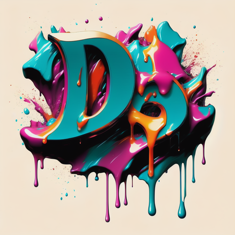

<a name="readme-top"></a>

<!-- PROJECT SHIELDS -->
[![Contributors][contributors-shield]][contributors-url]
[![Forks][forks-shield]][forks-url]
[![Stargazers][stars-shield]][stars-url]
[![Issues][issues-shield]][issues-url]
[![MIT License][license-shield]][license-url]


<!-- PROJECT LOGO -->
<br />
<div align="center">
  <a href="https://github.com/TeamEvian/rfe2307-front-end-capstone">
    
  </a>

<h3 align="center">Project Atelier</h3>

  <p align="center">
    We will be updating a clients retail web-portal that has become significantly outdated. This new project comprises a complete redesign of the retail portal designed to address this concern and modernize their site. We will be implementing a new user interface that will allow our customers to browse the items in the retail catalog. These user features will be focused on prioritizing the client experience and enabling customers to search, browse, add to cart, and checkout.
    <br />
    <a href="https://github.com/TeamEvian/rfe2307-front-end-capstone"><strong>Explore the docs »</strong></a>
    <br />
    <br />
    <a href="https://github.com/TeamEvian/rfe2307-front-end-capstone">Report Bug</a>
    ·
    <a href="https://github.com/TeamEvian/rfe2307-front-end-capstone">Request Feature</a>
  </p>
</div>


<!-- TABLE OF CONTENTS -->
<details>
  <summary>Table of Contents</summary>
  <ol>
    <li>
      <a href="#about-the-project">About The Project</a>
      <ul>
        <li><a href="#built-with">Built With</a></li>
      </ul>
    </li>
    <li>
      <a href="#getting-started">Getting Started</a>
      <ul>
         <li><a href="#requirements">Requirements</a></li>
        <li><a href="#installation">Installation</a></li>
      </ul>
    </li>
    <li><a href="#usage">Usage</a></li>
    <li><a href="#roadmap">Roadmap</a></li>
    <li><a href="#contact">Contact</a></li>
    <li><a href="#acknowledgments">Acknowledgments</a></li>
  </ol>
</details>


<!-- ABOUT THE PROJECT -->
## About The Project


<p align="right">(<a href="#readme-top">back to top</a>)</p>


### Built With

* [![React][React.js]][React-url]
* [![Babel][Babel.js]][Babel-url]
* [![Node][Node.js]][Node-url]
* [![Express][Express.js]][Express-url]
* [![Axios][Axios.js]][Axios-url]
* [![Webpack][Webpack.js]][Webpack-url]
* [![Jest][Jest.js]][Jest-url]
* [![AWS][AWS.js]][AWS-url]
* [![Tailwind][Tailwind.js]][Tailwind-url]

<p align="right">(<a href="#readme-top">back to top</a>)</p>


<!-- GETTING STARTED -->
## Getting Started

### Requirements

An `nvmrc` file is included if using [nvm](https://github.com/creationix/nvm).

- Node 6.13.0
- etc


### Installation

From within the root directory:

```sh
npm install
npm run build
```

<p align="right">(<a href="#readme-top">back to top</a>)</p>


<!-- USAGE EXAMPLES -->
## Usage

> Start the app: use npm start

> Open your web browser and navigate to `http://localhost:3000`.

> Explore different sections of the app by clicking on the navigation links. 

<p align="right">(<a href="#readme-top">back to top</a>)</p>


<!-- ROADMAP -->
## Roadmap
- [ ] Store Landing Page
    - [ ] Display storewide products
    - [ ] User product selection 
- [ ] Product Detail Page
    - [ ] Product Overview
        - [x] Fix CSS
    - [ ] Related Products
        - [x] Product comparison overview
        - [x] Customer outfit selection
        - [ ] Implement product image and detail caching
        - [ ] Decrease inital api request count
    - [ ] Question and Answers
        - [x] Add answers to questions
        - [x] Ask questions about product
        - [x] Search for questions
        - [ ] Photo magnification
    - [ ] Product Reviews
        - [x] Add review for product
        - [x] Filter reviews
        - [ ] Implement search bar
        - [ ] Allow responses from seller
- [ ] Mobile Responsive Design


See the [open issues](https://github.com/TeamEvian/rfe2307-front-end-capstone/issues) for a full list of proposed features (and known issues).

<p align="right">(<a href="#readme-top">back to top</a>)</p>


<!-- CONTACT -->
## Contact

Project Link: [https://github.com/github_username/repo_name](https://github.com/github_username/repo_name)

<p align="right">(<a href="#readme-top">back to top</a>)</p>


<!-- ACKNOWLEDGMENTS -->
## Acknowledgments

* Alisa Bondar [GitHub](https://github.com/alisabondar)
* Beck Baimouradov [GitHub](https://github.com/beckbay)
* LeDerius Franklin [GitHub](https://github.com/lederius)
* Jonathan Andrews [GitHub](https://github.com/andrews-jonathanw)

<p align="right">(<a href="#readme-top">back to top</a>)</p>


<!-- MARKDOWN LINKS & IMAGES -->
<!-- https://www.markdownguide.org/basic-syntax/#reference-style-links -->
[contributors-shield]: https://img.shields.io/github/contributors/TeamEvian/rfe2307-front-end-capstone.svg?style=for-the-badge
[contributors-url]: https://github.com/TeamEvian/rfe2307-front-end-capstone/graphs/contributors
[forks-shield]: https://img.shields.io/github/forks/TeamEvian/rfe2307-front-end-capstone.svg?style=for-the-badge
[forks-url]: https://github.com/TeamEvian/rfe2307-front-end-capstone/network/members
[stars-shield]: https://img.shields.io/github/stars/TeamEvian/rfe2307-front-end-capstone.svg?style=for-the-badge
[stars-url]: https://github.com/TeamEvian/rfe2307-front-end-capstone/stargazers
[issues-shield]: https://img.shields.io/github/issues/TeamEvian/rfe2307-front-end-capstone.svg?style=for-the-badge
[issues-url]: https://github.com/TeamEvian/rfe2307-front-end-capstone/issues
[license-shield]: https://img.shields.io/github/license/TeamEvian/rfe2307-front-end-capstone.svg?style=for-the-badge
[license-url]: https://github.com/TeamEvian/rfe2307-front-end-capstone/blob/master/LICENSE.txt
[product-screenshot]: images/screenshot.png

[React.js]: https://img.shields.io/badge/React-20232A?style=for-the-badge&logo=react&logoColor=61DAFB
[React-url]: https://reactjs.org/
[Babel.js]: https://img.shields.io/badge/Babel-F9DC3E.svg?style=for-the-badge&logo=Babel&logoColor=black
[Babel-url]: https://babeljs.io/
[Node.js]: https://img.shields.io/badge/node.js-6DA55F?style=for-the-badge&logo=node.js&logoColor=white
[Node-url]: https://nodejs.org/en
[Jest.js]: https://img.shields.io/badge/-jest-%23C21325?style=for-the-badge&logo=jest&logoColor=white
[Jest-url]: https://jestjs.io/
[Axios.js]: https://img.shields.io/badge/Axios-5A29E4.svg?style=for-the-badge&logo=Axios&logoColor=white
[Axios-url]: https://axios-http.com/docs/intro
[Express.js]: https://img.shields.io/badge/express.js-%23404d59.svg?style=for-the-badge&logo=express&logoColor=%2361DAFB
[Express-url]: https://expressjs.com/
[AWS.js]: https://img.shields.io/badge/Amazon%20AWS-232F3E.svg?style=for-the-badge&logo=Amazon-AWS&logoColor=white
[AWS-url]: https://aws.amazon.com/
[Webpack.js]: https://img.shields.io/badge/Webpack-8DD6F9.svg?style=for-the-badge&logo=Webpack&logoColor=black
[Webpack-url]: https://webpack.js.org/
[Tailwind.js]: https://img.shields.io/badge/tailwindcss-%2338B2AC.svg?style=for-the-badge&logo=tailwind-css&logoColor=white
[Tailwind-url]: https://tailwindcss.com
